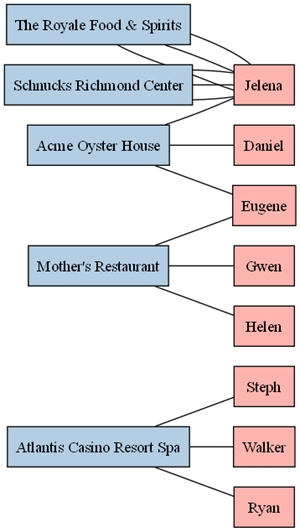
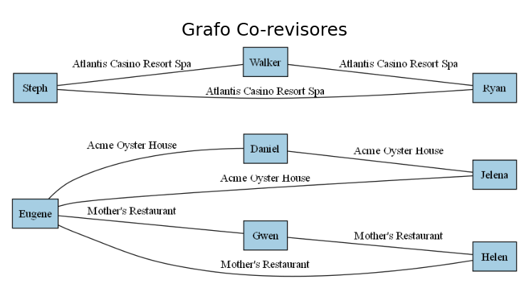
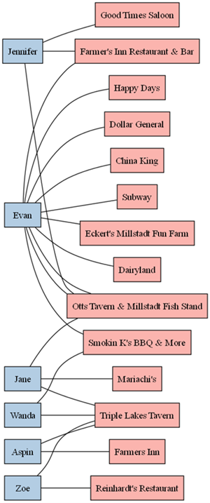
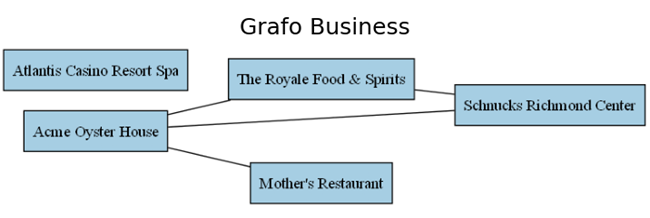
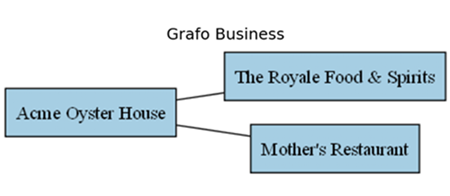
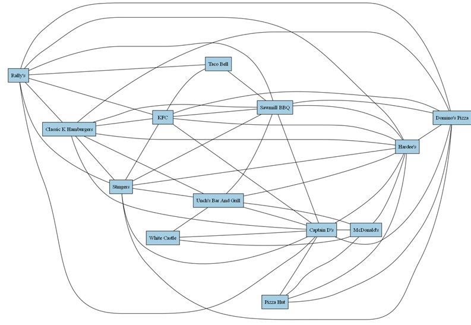

# EP01

O objetivo desta atividade é construir as funções designadas usando NetworkX.

## Orientações Gerais

* Use estritamente a estrutura já disponível, não altere nomes de arquivos ou sua localização e não altere o nome das funções, porque isto poderá inviabilizar a execução automática de testes durante o push do repositório;

* Os grupos devem implementar as soluções exclusivamente através da representação e manipulação de grafos usando NetworkX, juntamente com construções gerais de Python quando indispensável;

* Organize o código de forma consistente para facilitar sua legibilidade e apresente documentação apenas se necessário a sua compreensão. Por exemplo, evite espaçamentos entre linhas ou identação inconsistentes; use nomes de funções/variáveis significativos, documente o propósito de novas funções adicionadas e blocos lógicos mais complexos;

* Cada grupo deverá realizar este trabalho de forma individual, apresentando sua própria resposta. As respostas serão inspecionadas visualmente e mecanicamente com ferramentas especializadas. Nesta inspeção, caso seja detectada cópia de resposta, o(s) grupo(s) envolvido(s) sofrerão penalidade na nota e poderão ficar com nota 0; Caso seja detectado o uso de código gerado, a questão envolvida receberá 0 pontos;

* É importante salientar que é de responsabilidade do grupo manter o sigilo sobre sua solução. Para tal, não deixe sua solução em locais de visibilidade pública e acesso trivial;

* O trabalho deve ser realizado estritamente em grupo. A realização e entrega individual será penalizada com diminuição de 30% do valor da nota. Casos excepcionais, tais como assistência domiciliar ou desistência/indisponibilidade de membro(s) do grupo devem ser comunicados com antecedência.

## Entrega:

* Realize *push* com a versão final do repositório até o prazo definido na atividade do Google Classroom;

* Durante a fase de correção, será considerada a execução mais recente de workflows do Actions. No entanto, a equipe de ensino poderá também re-executar workflows, caso necessário;

* Caso seu projeto contenha algum erro de compilação ou testes não executam através do Actions, este não poderá ser corrigido;

* A participação de cada membro será comprovada através do histórico de edições e *commits* do repositório. A nota será dada apenas para aqueles que editarem efetivamente o repositório, utilizando o login específico atribuído no Team do GitHub (conta vinculada ao seu @ccc.ufcg.edu.br);
 
* Caso o repositório seja editado após o prazo para entrega, a atividade será considerada como reposição. Caso o grupo não tenha mais direito a reposição, não será contabilizada pontuação para a atividade.

## Organização do Repositório

* O folder `src` contém os arquivos onde as funções solicitadas neste exercício devem ser implementadas;
* o folder `test` contém testes automáticos para cada uma das funções a serem implementadas. Estes testes são automaticamente executados durante a submissão (*push*) de cada *commit* do repositório. Para executar estes testes no VSCode, use o seguinte comando no terminal, a partir do folder principal (como exemplo, considere a questão Q01). Dependendo da sua instalação, o executável de python pode ter outras denominações, como `python3`:

      python -m unittest test/test_Q01.py
 
 

* No folder principal, os trechos de código `main-<questão>.py` apresentam um ambiente para teste manual de cada função;

* O folder `graphs` possui exemplos de grafos YELP que podem ser utilizados neste exercício. Para visualizar estes grafos use o script `view_user_graph.py` no folder principal da seguinte forma (onde a opção `--connected` omite vértices isolados da visualização):

        python view_user_graph.py --graph graphs/IL/state_IL_city_Dupo.graphml

* O folder `gtufcg` contém funções para visualização gráfica.

## Domínio do Problema

[Yelp](https://www.yelp.com/) é uma plataforma online (site e aplicativo) criada em 2004 nos Estados Unidos, onde usuários avaliam e comentam sobre empresas locais, como restaurantes, bares, lojas, academias, hotéis, entre outros.
Os usuários podem dar notas de 1 a 5 estrelas, escrever reviews (comentários) e até publicar fotos dos estabelecimentos.

O [Yelp Dataset](https://www.kaggle.com/datasets/yelp-dataset/yelp-dataset) é um conjunto de dados público disponibilizado pela própria empresa Yelp para fins educacionais e de pesquisa.
Ele foi criado originalmente para a competição Yelp Dataset Challenge, com o objetivo de incentivar estudos sobre análise de sentimentos, recomendações, mineração de texto e comportamento de usuários.

Esse dataset é uma amostra real dos dados da plataforma, ou seja, não contém todas as empresas e usuários, mas um subconjunto representativo, com dados anônimos e tratados para proteger a privacidade.

O conjunto é dividido em vários arquivos (JSON ou CSV), cada um representando um tipo de informação:

Arquivo / Tabela	| Campos principais |	Descrição
--------------------|--------------------|-----------------------------
business	| business_id, name, address, city, state, stars, categories	| Informações sobre cada negócio (nome, localização, nota média, tipo de negócio, etc.). Uma mesma empresa pode ter business_id diferentes para cada endereço diferente
review	| review_id, user_id, business_id, stars, date, text	| Comentários e avaliações escritas pelos usuários sobre os estabelecimentos
user |	user_id, name, review_count, yelping_since, average_stars |	Dados sobre os usuários (número de reviews, média de notas, tempo de uso, etc.)
checkin | 	business_id, time |	Registros de check-ins (momentos em que usuários visitaram o local)
tip |	user_id, business_id, text, date	| Dicas rápidas ou comentários curtos deixados pelos usuários
photo	| photo_id, business_id, caption	| Fotos enviadas pelos usuários relacionadas aos estabelecimentos

O dataset foi extraído diretamente da base real do Yelp, passando por filtragem geográfica (selecionando cidades e regiões representativas), anonimização (remoção de nomes reais de pessoas e informações sensíveis), conversão para formato aberto (JSON/CSV) e publicação para uso acadêmico no Kaggle e no site oficial do Yelp Open Dataset.

Neste exercício, estaremos utilizando dados de `business`, `user` e `review`, os quais foram extraídos dos arquivos JSON originais e representados como grafos. 

A seguir apresentamos um exemplo de um grafo não-direcionado (Grafo `graphs/s_25_5.graphml`) gerado a partir destes dados para uso neste exercício. Nele, estão representados as entidades `user` e `business` como vértices e `review` como arcos. Como um usuário (`user`) pode realizar mais de uma revisão (`review`) para um mesmo negócio (`business`), o grafo é um multigrafo. Cada vértice e aresta possui um atributo `type` que indica o tipo do vértice/aresta. Neste exercício, denominado de **grafo** **YELP** todo grafo que apresenta este formato. Este grafo deve sempre ser construído ou importado como um multigrafo para que todas as arestas com revisões sejam incorporadas.

Exemplo de vértice do tipo `user` com atributos:

        ('2WnXYQFK0hXEoTxPtV2zvg', 
         {'type': 'user', 
          'name': 'Steph', 
          'review_count': 665, 
          'average_stars': 3.32, 
          'yelping_since': 
          '2008-07-25 10:41:00', 
          'label': 'Steph'})

onde '2WnXYQFK0hXEoTxPtV2zvg' é o identificador do vértice, correspondendo ao código do usuário no YELP academics.

Exemplo de vértice do tipo `business` com atributos:

        ('-OKB11ypR4C8wWlonBFIGw', 
         {'type': 'business', 
          'business_id': '-OKB11ypR4C8wWlonBFIGw', 
          'name': 'Atlantis Casino Resort Spa', 
          'address': '3800 S Virginia St', 
          'city': 'Reno', 
          'state': 'NV', 
          'postal_code': '89502', 
          'latitude': 39.4889071, 
          'longitude': -119.7936863, 
          'stars': 3.5, 
          'review_count': 1218, 
          'is_open': 1, 
          'attributes': '{...'}', 
          'categories': 'Casinos, Hotels & Travel, Arts & Entertainment, Resorts, Beauty & Spas, Day Spas', 
          'hours': "{'Monday': '0:0-0:0', 'Tuesday': '0:0-0:0', 'Wednesday': '0:0-0:0', 'Thursday': '0:0-0:0', 'Friday': '0:0-0:0', 'Saturday': '0:0-0:0', 'Sunday': '0:0-0:0'}", 'label': 'Atlantis Casino Resort Spa'}
        )

onde `-OKB11ypR4C8wWlonBFIGw` é o identificador do vértice, correspondendo ao código do negócio no YELP academics.

Exemplo de aresta do tipo `review` com atributos:

        ('-OKB11ypR4C8wWlonBFIGw', '2WnXYQFK0hXEoTxPtV2zvg', 
         {'type': 'review', 
          'review_stars': 3.0, 
          'review_date': '2009-03-09 08:12:47'
          }
        )

onde '-OKB11ypR4C8wWlonBFIGw' é um identificador de `business` e  '2WnXYQFK0hXEoTxPtV2zvg' é um identificador de `user`. 

## Questão 01 

Implemente a função `co-reviewers` que recebe um grafo YELP `g` como entrada e retorna um multigrafo onde os vértices são usuários e dois usuários são adjacentes quando revisaram o mesmo negócio. Note que podem existir arestas paralelas entre os usuários, caso revisem mais um negócio em comum. Se houverem múltiplas revisões em comum ao mesmo negócio, deve-se considerar apenas uma. Cada aresta do grafo resultante deve ter o atributo `business` indicando o negócio em comum correspondente ao relacionamento.

A figura abaixo ilustra um grafo YELP de entrada (`graphs/s_25_5.graphml`) e a saída esperada, o grafo de co-revisores. Note que este grafo mostra uma tendência a certos grupos de usuários utilizarem/revisarem um mesmo grupo de negócios. Este informação é importante em sistemas de recomendação (será utilizada na Questão 5).

A saída produzida pela função para gerar o grafo acima é esta:

        Vértices:
        [('j14WgRoU_-2ZE1aw1dXrJg', {}), ('MGPQVLsODMm9ZtYQW-g_OA', {}), 
        ('SgiBkhXeqIKl1PlFpZOycQ', {}), ('xoZvMJPDW6Q9pDAXI0e_Ww', {}), 
        ('2WnXYQFK0hXEoTxPtV2zvg', {}), ('qVc8ODYU5SZjKXVBgXdI7w', {}), 
        ('SZDeASXq7o05mMNLshsdIA', {}), ('1L3O2CUTk27SnmqyPBWQdQ', {})]

        Arestas:
        [('j14WgRoU_-2ZE1aw1dXrJg', 'MGPQVLsODMm9ZtYQW-g_OA', {'business': '_ab50qdWOk0DdB6XOrBitw'}), 
        ('j14WgRoU_-2ZE1aw1dXrJg', 'SgiBkhXeqIKl1PlFpZOycQ', {'business': '_ab50qdWOk0DdB6XOrBitw'}), 
        ('MGPQVLsODMm9ZtYQW-g_OA', 'SgiBkhXeqIKl1PlFpZOycQ', {'business': '_ab50qdWOk0DdB6XOrBitw'}), 
        ('SgiBkhXeqIKl1PlFpZOycQ', 'SZDeASXq7o05mMNLshsdIA', {'business': 'iSRTaT9WngzB8JJ2YKJUig'}), 
        ('SgiBkhXeqIKl1PlFpZOycQ', '1L3O2CUTk27SnmqyPBWQdQ', {'business': 'iSRTaT9WngzB8JJ2YKJUig'}), 
        ('xoZvMJPDW6Q9pDAXI0e_Ww', '2WnXYQFK0hXEoTxPtV2zvg', {'business': '-OKB11ypR4C8wWlonBFIGw'}), 
        ('xoZvMJPDW6Q9pDAXI0e_Ww', 'qVc8ODYU5SZjKXVBgXdI7w', {'business': '-OKB11ypR4C8wWlonBFIGw'}), 
        ('2WnXYQFK0hXEoTxPtV2zvg', 'qVc8ODYU5SZjKXVBgXdI7w', {'business': '-OKB11ypR4C8wWlonBFIGw'}), 
        ('SZDeASXq7o05mMNLshsdIA', '1L3O2CUTk27SnmqyPBWQdQ', {'business': 'iSRTaT9WngzB8JJ2YKJUig'})]

**Arquivos**:
* src/Q01.py (local onde a função deve ser construída)
* main_Q01.py (exemplo de uso da função)

**Testes**:

        python -m unittest -v test/test_Q01.py

## Questão 02

Implemente a função `get_business` que recebe um grafo YELP `g` como entrada e retorna um dicionário com os identificadores de business de cada cidade.

Para o grafo `graphs/s_25_5.graphml`, a função deve retornar:

        {
         'New Orleans': ['_ab50qdWOk0DdB6XOrBitw', 'iSRTaT9WngzB8JJ2YKJUig'], 
         'Reno': ['-OKB11ypR4C8wWlonBFIGw'], 
         'St. Louis': ['gKBqK-FFq7EGOUscBqb1iA'], 
         'Clayton': ['JaMZoosomwX7DDjkFOEo3g']
        }
      

**Arquivos**:

* src/Q02.py (local onde a função deve ser construída)
* main_Q02.py (exemplo de uso da função)

**Testes**:

        python -m unittest -v test/test_Q02.py

## Questão 03

Construa a função `intergraph_users` que recebe como entrada dois grafos YELP `g1` e `g2` e retorna um grafo simples (classe `Graph`) com usuários comuns aos dois grafos e todos os negócios que estes usuários revisaram e que estão presentes em pelo menos um destes grafos. Os vértices do grafo devem conter os mesmos atributos do grafo original, mas as arestas não precisam ter atributos. Cada aresta representa que alguma revisão foi realizada, não sendo necessário que possuam atributos. 

Como exemplo, considere os grafos YELP com dados das cidades *Millstadt* e *Dupo* (arquivos `IL/state_IL_city_Millstadt.graphml`
e `IL/state_IL_city_Dupo.graphml`). Os usuários que revisaram negócios destas duas cidades e os respectivos negócios são apresentados e ilustrados abaixo.

Os conjunto de vértices e arestas estão representados abaixo (listas são repetidas com labels dos vértices para melhor visualização):

        Vértices:
        ['ZL8cgMY7b8POMaxKgd6u3g', '62edU1CH_ki2L0FodOzavA', 'hKBQ-PFlcB-t5FK3HUxoyQ', 
        '9SQPIP8ASyy6J7Ujjzi3Ag', 'xdQzGzNu3nIUEvOGPW1tYw', 'dQg16IsfcluBTkuUDQuGDQ', 
        'YqximOhYJza5Bp4hhnSgUQ', 'jopXZhgCjhfx5KjFJKD-vw', 'CSkIucODjUoGRxiIONcSgg', 
        '4hhC-WUKaI-g4QoZEK7yig', 'ttKlWxEaX4trG30xkCDYkA', 'fypGyTRBy5b60RRPG_NQ5g', 
        'tTyFGm2z4zqMXEN_ZWLVfQ', '0bzkJPZaxJI0aWh20ayBJQ', 'K0xjMTLYdicHvwLKNFlUZw', 
        'Vr5bxmQ2C0XMXmT1WyamUQ', 'tzT32YLUpNy-Z2FN77aZrQ', 'mx1_2BxcIbZ1RKsGG_UPHg', 
        'TsohTE3w1br2m0Nb-tDRDA', 'NdgNF6Bpk1nLAcKg_j_r9w']
        Labels dos vértices:
        ['Evan', 'Jane', 'Wanda', 'Jennifer', 'Aspin', 'Zoe', 
         'Otts Tavern & Millstadt Fish Stand', 'Happy Days', "Farmer's Inn Restaurant & Bar", 
         "Reinhardt's Restaurant", 'Dollar General', 'Farmers Inn', 'China King', 'Subway', 
         "Smokin K's BBQ & More", "Mariachi's", "Eckert's Millstadt Fun Farm", 
         'Good Times Saloon', 'Dairyland', 'Triple Lakes Tavern']
        Arestas:
        [('ZL8cgMY7b8POMaxKgd6u3g', 'YqximOhYJza5Bp4hhnSgUQ'), ('ZL8cgMY7b8POMaxKgd6u3g', 'jopXZhgCjhfx5KjFJKD-vw'),
         ('ZL8cgMY7b8POMaxKgd6u3g', 'CSkIucODjUoGRxiIONcSgg'), ('ZL8cgMY7b8POMaxKgd6u3g', 'ttKlWxEaX4trG30xkCDYkA'), 
         ('ZL8cgMY7b8POMaxKgd6u3g', 'tTyFGm2z4zqMXEN_ZWLVfQ'), ('ZL8cgMY7b8POMaxKgd6u3g', '0bzkJPZaxJI0aWh20ayBJQ'), 
         ('ZL8cgMY7b8POMaxKgd6u3g', 'K0xjMTLYdicHvwLKNFlUZw'), ('ZL8cgMY7b8POMaxKgd6u3g', 'tzT32YLUpNy-Z2FN77aZrQ'), 
         ('ZL8cgMY7b8POMaxKgd6u3g', 'TsohTE3w1br2m0Nb-tDRDA'), ('62edU1CH_ki2L0FodOzavA', 'YqximOhYJza5Bp4hhnSgUQ'), 
         ('62edU1CH_ki2L0FodOzavA', 'Vr5bxmQ2C0XMXmT1WyamUQ'), ('62edU1CH_ki2L0FodOzavA', 'NdgNF6Bpk1nLAcKg_j_r9w'), 
         ('hKBQ-PFlcB-t5FK3HUxoyQ', 'K0xjMTLYdicHvwLKNFlUZw'), ('hKBQ-PFlcB-t5FK3HUxoyQ', 'NdgNF6Bpk1nLAcKg_j_r9w'), 
         ('9SQPIP8ASyy6J7Ujjzi3Ag', 'YqximOhYJza5Bp4hhnSgUQ'), ('9SQPIP8ASyy6J7Ujjzi3Ag', 'CSkIucODjUoGRxiIONcSgg'), 
         ('9SQPIP8ASyy6J7Ujjzi3Ag', 'mx1_2BxcIbZ1RKsGG_UPHg'), ('xdQzGzNu3nIUEvOGPW1tYw', 'fypGyTRBy5b60RRPG_NQ5g'), 
         ('xdQzGzNu3nIUEvOGPW1tYw', 'NdgNF6Bpk1nLAcKg_j_r9w'), ('dQg16IsfcluBTkuUDQuGDQ', '4hhC-WUKaI-g4QoZEK7yig'), 
         ('dQg16IsfcluBTkuUDQuGDQ', 'NdgNF6Bpk1nLAcKg_j_r9w')]
        Arestas com labels de vértices:
        [('Otts Tavern & Millstadt Fish Stand', 'Evan'), ('Happy Days', 'Evan'), 
         ("Farmer's Inn Restaurant & Bar", 'Evan'), ('Dollar General', 'Evan'), 
         ('China King', 'Evan'), ('Subway', 'Evan'), ("Smokin K's BBQ & More", 'Evan'), 
         ("Eckert's Millstadt Fun Farm", 'Evan'), ('Dairyland', 'Evan'), 
         ('Otts Tavern & Millstadt Fish Stand', 'Jane'), ("Mariachi's", 'Jane'), 
         ('Triple Lakes Tavern', 'Jane'), ("Smokin K's BBQ & More", 'Wanda'), 
         ('Triple Lakes Tavern', 'Wanda'), ('Otts Tavern & Millstadt Fish Stand', 'Jennifer'), 
         ("Farmer's Inn Restaurant & Bar", 'Jennifer'), ('Good Times Saloon', 'Jennifer'), 
         ('Farmers Inn', 'Aspin'), ('Triple Lakes Tavern', 'Aspin'), 
         ("Reinhardt's Restaurant", 'Zoe'), ('Triple Lakes Tavern', 'Zoe')]

**Arquivos**:

* src/Q03.py (local onde a função deve ser construída)
* main_Q03.py (exemplo de uso da função)

**Testes**:

        python -m unittest -v test/test_Q03.py

## Questão 04

Implemente a função `find_business` que recebe como entrada um grafo YELP `g` e um identificador de usuário `u` e retorna uma lista de identificadores de negócios nos quais o usuário pode ter interesse. Esta lista inclui todos os negócios revisados pelos co-revisores deste usuário, excluindo os negócios que já foram revisados pelo usuário. 

Como exemplo, para o grafo abaixo (`graphs/s_25_5.graphml`) e o usuário com nome `Helen` (`1L3O2CUTk27SnmqyPBWQdQ`), a função deve retornar:

        ['_ab50qdWOk0DdB6XOrBitw', 'gKBqK-FFq7EGOUscBqb1iA', 'JaMZoosomwX7DDjkFOEo3g']

os quais são identificadores de:

        ['Acme Oyster House', 'The Royale Food & Spirits', 'Schnucks Richmond Center']

        

 **Arquivos**:

* src/Q04.py (local onde a função deve ser construída)
* main_Q04.py (exemplo de uso da função)

**Testes**:

        python -m unittest -v test/test_Q04.py

## Questão 05

Implemente a função `business_graph` que recebe como entrada um grafo YELP `g`, uma palavra-chave `category` que representa uma categoria de negócio (ver propriedade `categories`) e retorna um grafo com negócios que atendem a esta categoria. O grafo deve ter como vértices apenas negócios. Neste grafo, dois negócios são adjacentes se a distância entre eles no grafo `g` é igual a 2, ou seja, pelo menos um mesmo usuário tiver feito revisão dos 2 negócios. 

A Figura abaixo ilustra um grafo YELP de entrada, `graphs/s_25_5.graphml`, e a saída esperada, o grafo de negócios resultante, quando a categoria for `''`. Neste caso, todos os negócios devem ser retornados. Segue também o conjunto de vértice do grafo de negócios.

        ['_ab50qdWOk0DdB6XOrBitw', '-OKB11ypR4C8wWlonBFIGw', 'gKBqK-FFq7EGOUscBqb1iA', 
        'JaMZoosomwX7DDjkFOEo3g', 'iSRTaT9WngzB8JJ2YKJUig']

Se a categoria for `Restaurant`, o conjunto de vértices do grafo de negócios, juntamente com a visualização gráfica seguem abaixo.

        ['_ab50qdWOk0DdB6XOrBitw', 'gKBqK-FFq7EGOUscBqb1iA', 'iSRTaT9WngzB8JJ2YKJUig']

Para o grafo `graphs/IL/state_IL_city_Cahokia.graphml` e categoria `Restaurant`, o conjunto de vértice do grafo de negócios, juntamente com a visualização do grafo seguem abaixo.

        ['q1LlkxzJ1VEzKedgPrcDlw', 'cVOC5jLNpP78yf5kh-gx_g',
         'O998e7eUN45YDid-GxM1yw', 'svLMFkLybFiadbTo_6g-hg', 
         '59hqWP1E1pfjshhHSu0OxA', 'YWcH3SLyRIBHIBBgudqZLw',
         '6BJwqc8rShdKHyizuR0Q5g', 'ysFWQ_XGmiN_sOgHmxKySQ', 
         'v_jBLgeJ1z5uVDzpZ-Wbkw', 'HRZmsTNLtZRBbJUuWjzLTg',
          'QDgGe--XQrPrap3u5EjAmg', 's5tkn1ngXJff90tP_iQ0YA', 
          'KeT8uehA2gVy6sycGdl_OQ'
        ]

 **Arquivos**:

* src/Q05.py (local onde a função deve ser construída)
* main_Q05.py (exemplo de uso da função)

**Testes**:

        python -m unittest -v test/test_Q05.py
